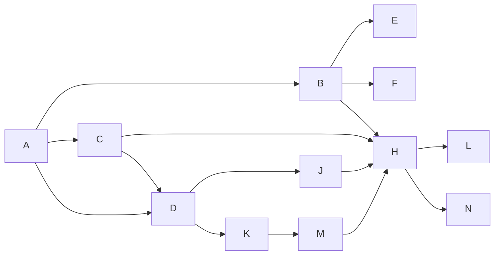
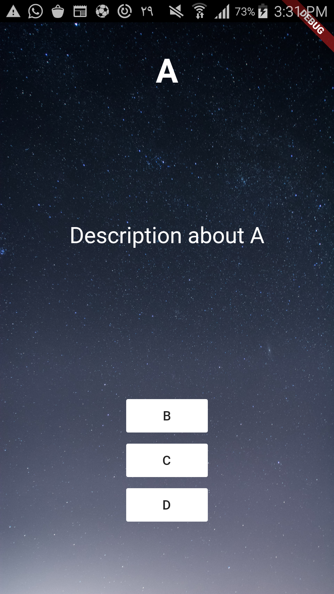

# Destini App

Destini is a simple prototype application representing user-decision based storytelling.
This means developer will define multiple paths for a story, for example in page A, user can decide the story's character choses option B or C, and story path will change based on it's decision.
I tried to define story pages objects as simple as possible. But still I'm sure there are better and efficient ways to do it.

# Sample story

If you download source code, you can see that there's a sample story defined in an array. The diagram of the story is shown below :


And such complex diagram could be described as an array below :
```Dart
Map<int, StoryPage> pages = {
  1: StoryPage(
      id: 1,
  title: "A",
  text: "Description about A",
  pageOptions: [
        PageOption(dest_id: 2, option_text: "B"),
  PageOption(dest_id: 3, option_text: "C"),
  PageOption(dest_id: 4, option_text: "D"),
  ],
  inits_storyboard: true),
  2: StoryPage(
    id: 2,
  title: "B",
  text: "Description about B",
  pageOptions: [
      PageOption(dest_id: 5, option_text: "E"),
  PageOption(dest_id: 6, option_text: "F"),
  PageOption(dest_id: 7, option_text: "H"),
  ],
  ),
  3: StoryPage(
    id: 3,
  title: "C",
  text: "Description about C",
  pageOptions: [
      PageOption(dest_id: 4, option_text: "D"),
  PageOption(dest_id: 7, option_text: "H"),
  ],
  ),
  4: StoryPage(
    id: 4,
  title: "D",
  text: "Description about D",
  pageOptions: [
      PageOption(dest_id: 8, option_text: "J"),
  PageOption(dest_id: 9, option_text: "K"),
  ],
  ),
  5: StoryPage(
    id: 5,
  title: "E",
  text: "Description about E",
  pageOptions: [],
  ),
  6: StoryPage(
    id: 6,
  title: "F",
  text: "Description about F",
  pageOptions: [],
  ),
  7: StoryPage(
    id: 7,
  title: "H",
  text: "Description about H",
  pageOptions: [
      PageOption(dest_id: 10, option_text: "L"),
  PageOption(dest_id: 12, option_text: "N"),
  ],
  ),
  8: StoryPage(
    id: 8,
  title: "J",
  text: "Description about J",
  pageOptions: [
      PageOption(dest_id: 7, option_text: "H"),
  ],
  ),
  9: StoryPage(
    id: 9,
  title: "K",
  text: "Description about K",
  pageOptions: [
      PageOption(dest_id: 11, option_text: "M"),
  ],
  ),
  10: StoryPage(
    id: 10,
  title: "L",
  text: "Description about L",
  pageOptions: [],
  ),
  11: StoryPage(
    id: 11,
  title: "M",
  text: "Description about M",
  pageOptions: [
      PageOption(dest_id: 7, option_text: "H"),
  ],
  ),
  12: StoryPage(
    id: 12,
  title: "N",
  text: "Description about N",
  pageOptions: [],
  ),
};
```

As you can see there's StoryPage object, which defines our squares in diagram above. The most important thing is, you should define one and only one initiative Story Page.

## Contribution and Issues
If you want to contribute in this project and add some feature, I'd be happy to read your pull requests.

### TODOs

 - [ ] Design new UI.

#### Museum of Progress.

